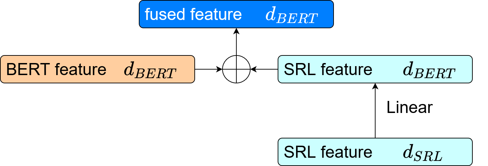
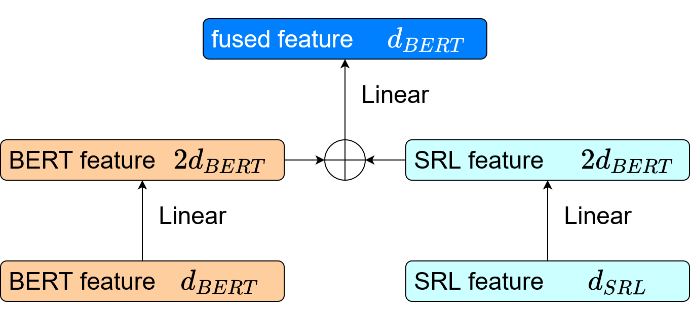

### Overview ###
This subfolder is specially for doing experiments for modification on semantic integration. Please follow `../README.md` to download the data and put the data into `./glue_data/`. The settings for training and evalutation following the original SemBERT, which is the same as other two modifications.

### Command for Training and Evaluation ###
```shell
CUDA_VISIBLE_DEVICES=0
EXPNAME=$1
OUTPUT_DIR=glue/${EXPNAME}
mkdir -p $OUTPUT_DIR
python3 \
	run_classifier.py \
	--data_dir glue_data/SNLI/ \
	--task_name snli \
	--train_batch_size 32 \
	--max_seq_length 128 \
	--bert_model bert-base-uncased \
	--learning_rate 2e-5 \
	--num_train_epochs 2 \
	--do_train \
	--do_eval \
	--do_lower_case \
	--max_num_aspect 3 \
	--output_dir $OUTPUT_DIR
```

### Model Selection ###
The models are specified ```./pytorch_pretrained_bert/modeling.py```. ```class SemanticIntegrationMLP1``` is for Addition Strategy 1, and ```class SemanticIntegrationMLP2``` is for Addition Strategy 2. The selection of the model is represented as the variable ```self.semintmlp``` in the ```__init__()``` function of ```class BertForSequenceClassificationTag```. Note that there are other additional classes such as ```OurCNN```, ```OurMLP``` and etc., which are the legacies of other explorations.
```python
class BertForSequenceClassificationTag(BertPreTrainedModel):
    def __init__(self, config, num_labels=2, tag_config=None):
        super(BertForSequenceClassificationTag, self).__init__(config)
        self.num_labels = num_labels
        self.bert = BertModel(config)
        self.filter_size = 3
        self.cnn = CNN_conv1d(config, filter_size=self.filter_size)
        self.activation = nn.Tanh()
        self.dropout = nn.Dropout(config.hidden_dropout_prob)
        # self.cnn = OurCNN(config, filter_size=self.filter_size)
        # self.nextmlp = OurMLP(config)
	
	# Specify the model in the following line:
        self.semintmlp = SemanticIntegrationMLP2(config, tag_config)
```

### Addition Strategy 1 ###

Addition Strategy 1 casts the SRL feature into the dimension same as the BERT feature and then adds the two features together as the fused feature.


### Addition Strategy 2 ###

Addition Strategy 2 casts both the SRL feature and the BERT feature into the dimension that is 2 times the original BERT feature and then adds the two features as the fused feature.

