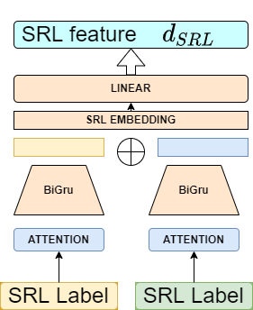

## CE7455-Project SRL EMBEDDING 

In the following codes, we modify the srl embedding layer by changing the embedding models
and also we add an option for using attention scheme to run the code 

Here is the command for running the codes
```shell
CUDA_VISIBLE_DEVICES=0
EXPNAME=$1
OUTPUT_DIR=glue/${EXPNAME}
mkdir -p $OUTPUT_DIR
python3 \
	run_classifier.py \
	--data_dir glue_data/SNLI/ \
	--task_name snli \
	--train_batch_size 32 \
	--max_seq_length 128 \
	--bert_model bert-base-uncased \
	--learning_rate 2e-5 \
	--num_train_epochs 2 \
	--do_train \
	--do_eval \
	--do_lower_case \
	--max_num_aspect 3 \
	--output_dir $OUTPUT_DIR \
	--srl_embedding linear \
	--srl_attention False 
```
Note that for srl_embedding, you can choose 'linear','gru' and 'bigru', all in lowercase.
In default, the srl_attention is false as it does not improve the accuracy.
 

### Demo ###
**Structure for using attention and bigru**



